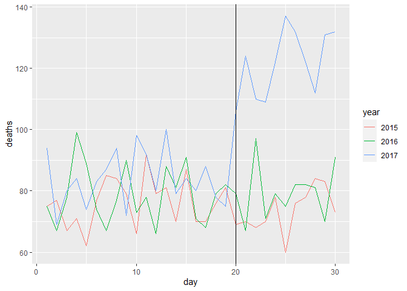

report-puerto-rico-hurricane-maria
================
cgoldner
2 6 2021

## load packages

``` r
library(tidyverse)
```

    ## -- Attaching packages --------------------------------------- tidyverse 1.3.1 --

    ## v ggplot2 3.3.3     v purrr   0.3.4
    ## v tibble  3.1.1     v dplyr   1.0.6
    ## v tidyr   1.1.3     v stringr 1.4.0
    ## v readr   1.4.0     v forcats 0.5.1

    ## -- Conflicts ------------------------------------------ tidyverse_conflicts() --
    ## x dplyr::filter() masks stats::filter()
    ## x dplyr::lag()    masks stats::lag()

``` r
library(pdftools)
```

    ## Using poppler version 21.04.0

``` r
options(digits = 3)    # report 3 significant digits
```

## load PDF data

``` r
fn <- system.file("extdata", "RD-Mortality-Report_2015-18-180531.pdf", package="dslabs")
```

## extract text from pdf per page

``` r
text <- pdf_text(fn)
```

## split text per page into lines

``` r
x <- str_split(text[9], "\n")
s <- x[[1]]
s <- str_trim(s)
```

## read header of table

``` r
header_index <- str_which(s, "2015")[1]

header <- s[header_index]
month <- str_split(header, "\\s+", simplify = TRUE)
header <- month[, 2:5]
month <- month[,1]
```

## locate lines relevant for table

``` r
tail_index <- str_which(s, "Total")
tail_index
```

    ## [1] 36

``` r
n <- lengths(str_extract_all(s, "\\d+"))
```

## save table into data frame

``` r
ind <- setdiff((header_index+1):(tail_index-1), which(n==1))
s <- s[ind]
s <- str_remove_all(s, "[^\\d\\s]")
class(s)
```

    ## [1] "character"

``` r
s <- str_split_fixed(s, "\\s+", n = 6)[, 1:5]
s <- as.data.frame(s)
s <- s %>% mutate_all(parse_number)

header <- c("day", header)
s <- setNames(s, header)
col_month <- rep(month, nrow(s))
s$month <- col_month
tab <- s[, c("month", header)]
```

## calculate means relevant for comparison befor and after hurricane

``` r
mean(tab$"2015")
```

    ## [1] 75.3

``` r
mean(tab$"2016")
```

    ## [1] 78.9

``` r
mean(tab$"2017"[1:19])
```

    ## [1] 83.7

``` r
mean(tab$"2017"[20:30])
```

    ## [1] 122

## tidy up the table

``` r
tab <- tab %>% gather(year, deaths, -day, -month)
```

## save tidy table

``` r
save(tab, file = "rda/mortality-rep-sep.rda")
```

## create plot that shows deaths per day and when the hurricane hit

``` r
tab %>% filter(year != 2018) %>%
  ggplot(aes(day, deaths, color = year)) +
  geom_line() +
  geom_vline(xintercept = 20)
```

<!-- -->
